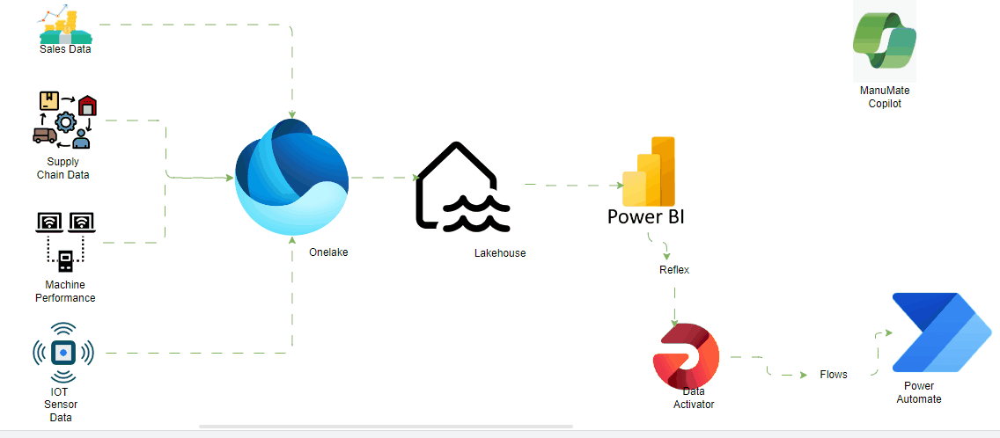

# OptiManuAI: All-in-One AI Solution for Manufacturing

Welcome to OptiManuAI, your comprehensive AI solution tailored for the manufacturing industry. OptiManuAI is designed to revolutionize the way manufacturing processes are managed by seamlessly integrating cutting-edge technologies to enhance efficiency, predict future trends, and optimize every aspect of your operations.

## Architectural Setup

## Table of Contents
- [Introduction](#introduction)
- [Key Components](#key-components)
  - [1. Data Ingestion & Processing](#data-ingestion--processing)
  - [2. Predictive Analytics Engine](#predictive-analytics-engine)
  - [3. Optimization Algorithms](#optimization-algorithms)
  - [4. Data Visualization Tools](#data-visualization-tools)
  - [5. Integration Layer](#integration-layer)
- [Getting Started](#getting-started)
- [License](#license)

## Introduction

OptiManuAI is an all-encompassing solution designed to meet the specific needs of the manufacturing industry. By leveraging advanced artificial intelligence, predictive analytics, and optimization algorithms, OptiManuAI empowers manufacturers to make informed decisions, streamline processes, and enhance overall productivity.

## Key Components

### 1. Data Ingestion & Processing

The heart of OptiManuAI lies in its ability to collect and process data from diverse sources, including IoT sensors, sales data, and supply chain information. This component ensures that the data is cleaned, standardized, and ready for analysis.

### 2. Predictive Analytics Engine

OptiManuAI's Predictive Analytics Engine utilizes state-of-the-art machine learning algorithms to forecast future demand, predict equipment failures, and determine optimal inventory levels. This core component drives the solution's ability to deliver invaluable insights.

### 3. Optimization Algorithms

Building on the predictions made by the Predictive Analytics Engine, Optimization Algorithms fine-tune manufacturing processes. From production schedules to inventory levels and supply chain routes, these algorithms ensure optimal resource utilization and efficiency.

### 4. Data Visualization Tools

OptiManuAI provides intuitive Data Visualization Tools that present analytics and optimization results in a user-friendly format. Decision-makers can easily comprehend and act upon the insights generated, fostering a more agile and responsive manufacturing environment.

### 5. Integration Layer

Seamless integration with existing systems, such as ERP and CRM, is facilitated by the Integration Layer. OptiManuAI ensures that it maximizes the use of available data and functionalities without disrupting your current operations.

## Getting Started
To Gain insights from the `OptiManuAI` solution, we built a custom copilot- `ManuMate` to help in the interpretation of the insights generated from the Fabric Solution

### User Interaction: 
- `ManuMate Copilot` interacts with the users, answering their questions about the System, guiding them through its features, and helping them interprete the insights it generates

### Data Exploration:
- `ManuMate Copilot` explains the results generated b the predictive analytics engine from `Fabric` and Optimization algorithms in a user-friendly way. It provides recommendations based on these results

### System Monitoring
- `ManuMate Copliot` monitors the system's performance, alerting users to any potential issue or anomalies

### Integration with Other Systems
- `ManuMate Copilot` integrates with the rest of the company systems like `ERP`, `CRM` pulling in relevant data to provide a more comprehensive view of the manufacturing process

### Continuous Learning
- `ManuMate Copilot` learns from user interactions, continuously improves its ability to provide relevant and useful information

### Security and Compliance
- Just like any other copilot built by help of Copilot studio, `ManuMate Copilot` ensures all interactions comply with relevant regulations and standards,and user data is secure.

## License

OptiManuAI is licensed under the [MIT License](./LICENSE). Feel free to explore, modify, and distribute this solution according to the terms of the license.
